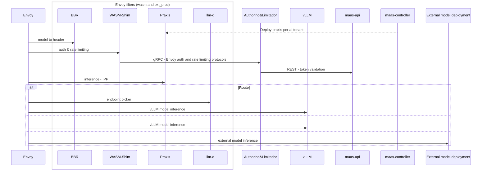
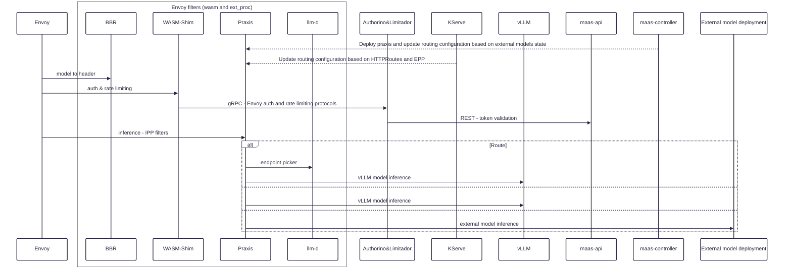
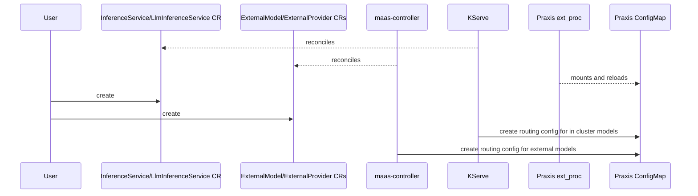

# 3.6 AI-Gateway - Praxis as Envoy ext-proc

### Intro

This discussion aims to address different options to replace the Go IPP Envoy ext_proc with Praxis IPP for the 3.6 release.

### Goals

- Introduce Praxis ext_proc as a replacement for the current Go IPP ext_proc. 
- No impact on how users consume the KServe and MaaS APIs (CRs or REST)

### OPTION 1 - Envoy owns the inference routing logic

### Assumptions
- Praxis in ext_proc mode is not aware of the Istio control plane (Gateway, HTTPRoute, etc.)

#### PROS
- Low/no risk for 3.6
- llm-d, InferenceService, LLMInferenceService routing remains unchanged.

#### CONS
- Praxis behaves like an actual ext_proc returning control to Envoy for next-phase routing, leading to an extra network hop.
- Not aligned with the long-term vision

#### Work needed
- MaaS controller still needs to deploy Praxis instead of the current IPP. Even if the current IPP deployment is not ideal, until the AI-Gateway controller is ready we need a tactical solution to deploy Praxis ext_proc. No need to separately configure model routing in Praxis since this is already done at the Istio control plane and the Envoy data plane solves routing.

#### Model deployment implications

Since Envoy is still the router, the current KServe model deployment for InferenceService, LLMInferenceService, etc. CRs remains the same. The HTTPRoutes are attached to the designated gateway, and this may or may not be a MaaS Gateway.

### OPTION 2 - Praxis ext_proc owns the inference routing logic

### Assumptions
- Praxis in ext_proc mode is not aware of the Istio control plane (Gateway, HTTPRoute, etc.)
- Praxis IPP filter does not perform kube watch on the ExternalModel and ExternalProvider CRs.

#### PROS
- Aligned with the long-term view where Praxis owns the routing logic. The implication is that no other ext_proc can be configured in Envoy after Praxis since Praxis resolves the routing.
- Fewer network hops
- Easier to address potential routing/traffic issues

#### CONS
- More risks involved since this implies a new routing topology.
- Internal models configuration in Praxis - driven by KServe
- llm-d configuration in Praxis - driven by KServe
- External models configuration in Praxis - driven by MaaS

#### Work needed
- MaaS controller still needs to deploy Praxis instead of the current IPP (as in Option 1). At a high level, this is a replacement operation. Relevant work has been shown here: https://github.com/praxis-proxy/grid/pull/22
- ExternalModels and ExternalProviders CRs need to be reconciled in maas-controller (temporarily) if the AI-Gateway controller is not ready. Currently, IPP ext_proc acts as a kube informer as well, but this is not the case with Praxis. Not sure yet how external credentials will be propagated from kube secrets as these cannot exist in ConfigMaps and we don't know upfront which secrets to mount on the Praxis pod.
- For llm-d integration, we have ext_proc-to-ext_proc communication. Thus Praxis needs to also act as an ext_proc client in order to call llm-d.

#### Model deployment implications

- KServe manages the HTTPRoute for InferenceService and LLMInferenceService CRs, including the specification of an inference scheduler (llm-d) and creates InferencePool, InferenceModel CRs. However, Praxis ext_proc is not aware of these HTTPRoutes. This implies that KServe needs to generate the correct Praxis configuration for each model deployed. Even if the model deployed is not attached to a MaaS gateway, we assume that the routing is still solved by Praxis ext_proc, not Envoy, so KServe would still need to generate the appropriate Praxis configurations.
- ExternalModels/ExternalProviders - as mentioned above, the Praxis IPP won't perform the kube watch operation on these CRs. Thus maas-controller needs to reconcile these CRs and update the Praxis configuration accordingly.

#### Dynamic configuration of Praxis routing

Using overlay JSON for the `intelligent_route` filter. This file is mounted from a ConfigMap that could be updated by KServe and MaaS controllers. But overlays may not be enough, as we also need to configure the `load_balancer` filter to point to the right cluster endpoints (each KServe deployment or ExternalModel may need to be declared as a separate Praxis cluster). So how exactly Praxis needs to be configured in order to solve routing for internal models, external models, and llm-d is something that we still need to address.

#### Control plane flow

This flow shows how the current model CRS (LLMISVC, ISVC, ExternalModel/ExternalProvider) continues to be managed by the user as today however the internal machinery in KServe and MaaS controllers need to update the Praxis config in order to apply the correct routes.
