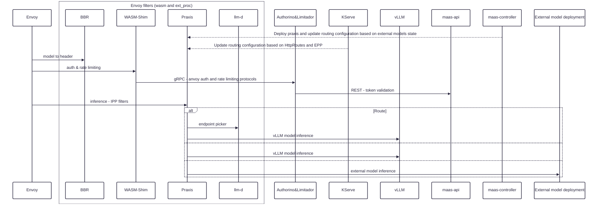

# 3.6 AI-Gateway - Praxis as Envoy ext-proc

### OPTION 1 - Envoy owns the inference routing logic

### Assumptions
- Praxis in ext_proc mode is not aware of Istio control plane (Gateway, HttpRoute etc)

#### PROS
- Low/no risc for 3.6
- llm-d, InfenrenceServicem LlmInferenceService routing remains unchanged.

#### CONS
- Praxis behaves like an actual ext_proc returning the control to Envoy for next phase routing leading to an extra network hop.
- Not aligned with the long term vision

### Work needed
- MaaS controller still needs to deploy Praxis instead of the current IPP. Even if the current IPP deployment is not ideal, until AI-Gateway controller is ready we need a tactical solution to deploy Praxis ext_proc. No need to separatelly configure model routing in Praxis since this already done at Istio control plane and Envoy data plane solves routing.

### OPTION 2 - Praxis ext_proc owns the inference routing logic

### Assumptions
- Praxis in ext_proc mode is not aware of Istio control plane (Gateway, HttpRoute etc)

#### PROS
- Aligned with the long term view where Praxis owns the routing logic. The implication is that no other ext_proc can be configured in Envoy after Praxis since Praxis resolves the routing.
- Less network hops
- Easier to address potential routing/traffic issues

#### CONS
- More risks involved since this implies a new routing topoligy.
- internal models configuration in praxis - kserve
- llm-d configuration in praxis - driven by kserve
- external models configuration in praxic - driven by maas

#### High Work needed
- MaaS controller still needs to deploy Praxis instead of the current IPP (as in Option 1). At high level this is a replacement operation. Relevant work has been shown here: https://github.com/praxis-proxy/grid/pull/22 
- ExternalModels and ExternalProviders CRs need to be reconciled in maas-controller (temporary) if ai-gateway controller is not ready. Currently, IPP ext_proc acts as a kube informer as well but this is not the case with Praxis. Not sure yet how external credentials will be propagated from kube secrets as these cannot exist in configmaps and we don't know upfront which secrets to mount on the praxis POD.
- For llm-d integration we have the ext_proc to ext_proc communication. Thus Praxis needs to also act as an ext_proc client in order to call llm_d. 

#### Dynamic configuration of praxis routing

- Using overlay json for `inteligent_route` filter. This file is mounted from a configmap that could be updated by kserve and maas controllers. But overlays may not be enough as we also need to configure the `load_balancer` filter to point to the right cluster endpoints (each kserve deployment or ExternalModel may need to be declared as a separate Praxis cluster).

