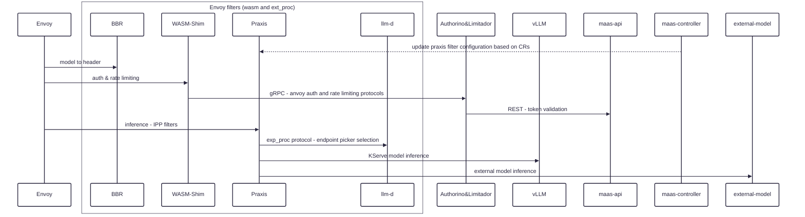

# 3.6 AI-Gateway - Praxis as Envoy ext-proc

```mermaid
---
config:
  theme: redux
---
sequenceDiagram
    participant Envoy
    box Envoy filters (wasm and ext_proc)
        participant BBR
        participant WASM-Shim
        participant Praxis
        participant llm-d
    end
    participant AL as Authorino&Limitador
    participant vLLM
    participant maas-api
    participant maas-controller
    participant external-model

    maas-controller-->>Praxis: update praxis filter configuration based on CRs
    Envoy->>BBR: model to header
    Envoy->>WASM-Shim: auth & rate limiting
    WASM-Shim->>AL: gRPC - anvoy auth and rate limiting protocols
    AL->>maas-api: REST - token validation 
    Envoy->>Praxis: inference - IPP filters
    Praxis->>llm-d: exp_proc protocol - endpoint picker selection
    Praxis->>vLLM: KServe model inference
    Praxis->>external-model: external model inference
 
```

